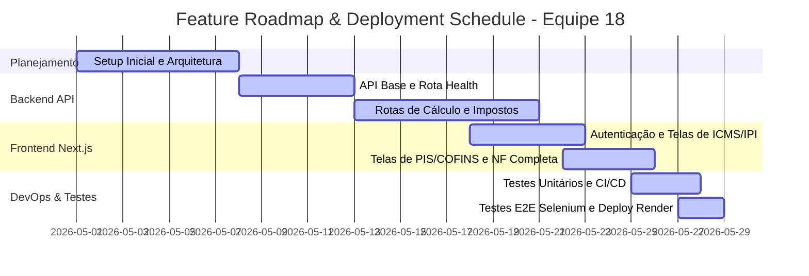

# Cronograma de Implantação e Feature Roadmap: Equipe 18
**Projeto:** Calculadora e Simulador de Impostos de Nota Fiscal  
**Grupo:** Equipe 18  

O cronograma de desenvolvimento e implantação do projeto da **Equipe 18** foi organizado em etapas lógicas e marcos incrementais (Milestones), visando garantir entregas de software funcionais e testadas continuamente.

---

## 1. Cronograma de Desenvolvimento (Phases e Marcos)

---

## 2. Detalhamento de Fases, Responsabilidades e Status

### Fase 1: Setup Inicial, Arquitetura e Estruturação (Março / Abril)
* **Objetivo**: Definição da arquitetura técnica (Backend Fastify/Express + Frontend Next.js 15 SPA), configuração inicial de repositórios git e estruturação de pacotes npm/pnpm.
* **Feature/Entregável**:
  * Setup inicial dos repositórios locais e remotos.
  * Criação do esqueleto de diretórios de API e aplicação.
  * Definição da stack de design visual (TailwindCSS 4).
* **Responsáveis**: João Gabriel (JG).
* **Status**: **Concluído** 🟢

### Fase 2: Desenvolvimento de Serviços de API Backend (Início de Maio)
* **Objetivo**: Implementação matemática de regras tributárias brasileiras de precisão e endpoints da API REST.
* **Feature/Entregável**:
  * **[Local NF Service]**: Estruturação dos motores matemáticos de cálculo.
  * **[Rota ICMS]**: API para buscar alíquotas e calcular o ICMS baseado no estado selecionado.
  * **[Rota IPI]**: API de cálculo sobre base bruta + despesas/frete.
  * **[Rota PIS/COFINS]**: Algoritmo para apuração em regime cumulativo e não cumulativo.
  * **[Rota NF Completa]**: Consolidação global de impostos.
* **Responsáveis**: Pedro Daou (ICMS/IPI) e Gabriel Bonatto (PIS/COFINS), João Gabriel (NF Completa & Rota Health).
* **Status**: **Concluído** 🟢

### Fase 3: Desenvolvimento do Frontend Next.js & UI/UX (Meados de Maio)
* **Objetivo**: Interfaces ricas em experiência do usuário, responsividade e proteção de segurança de rotas corporativas.
* **Feature/Entregável**:
  * **[Tela de Autenticação]**: Form de login corporativo seguro (`admin` / `admin`).
  * **[Painéis Individuais]**: Telas limpas e guiadas para preenchimento de dados de ICMS, IPI e PIS/COFINS.
  * **[Simulador Completo]**: Tela de Nota Fiscal Completa contendo feedbacks visuais e gráficos.
  * **[Páginas Institucionais]**: Telas de "Sobre a Equipe" e central de "Ajuda (Help)".
* **Responsáveis**: Pedro Daou (Telas ICMS/IPI), Gabriel Bonatto (PIS/COFINS, Sobre e Help) e João Gabriel (Setup SPA, AuthProvider e UI Shell).
* **Status**: **Concluído** 🟢

### Fase 4: Garantia de Qualidade (QA), Testes e DevOps (Final de Maio)
* **Objetivo**: Implementação das pirâmides de testes para conferência matemática e de navegação de usuário de forma automatizada na esteira CI/CD.
* **Feature/Entregável**:
  * **[Testes Unitários]**: Validação no backend de todas as funções matemáticas de cálculo tributário através do Jest.
  * **[CI/CD Workflow]**: Setup de GitHub Actions para automatizar a execução de testes a cada push em qualquer branch.
  * **[Deploy Automatizado]**: Configuração de hooks para deploy contínuo em produção no Render.
  * **[Testes Funcionais E2E]**: Robôs do Selenium WebDriver simulando o login de usuário, preenchimento de inputs e apuração de resultados visuais, salvando prints como relatórios de sucesso.
* **Responsáveis**: Gabriel Bonatto e Pedro Daou (Testes Unitários / Docs), João Gabriel (DevOps, CI/CD, Deploy Render e Testes E2E Selenium).
* **Status**: **Concluído** 🟢

---

## 3. Marcos de Implantação (Milestones)

| Milestone | Descrição Técnica | Data Alvo | Status | Evidência |
| :--- | :--- | :--- | :--- | :--- |
| **M1** | API Gateway REST operando e respondendo rotas no backend local. | 15/05/2026 | **Concluído** 🟢 | Sucesso de testes Jest unitários |
| **M2** | Frontend Next.js integrado com autenticação corporativa e exibindo formulários. | 22/05/2026 | **Concluído** 🟢 | Renderização client-side |
| **M3** | Pipeline de CI/CD automatizada no GitHub Actions e deploy ativo no Render. | 26/05/2026 | **Concluído** 🟢 | deploy.yml operando |
| **M4** | Robôs de testes funcionais Selenium WebDriver cobrindo 100% dos fluxos críticos de ponta a ponta. | 28/05/2026 | **Concluído** 🟢 | Artefatos screenshots salvos no CI |

---

## 4. Próximos Passos ( roadmap futuro )
* **Refinamento de UX**: Micro-interações e suporte nativo a temas (Light/Dark Mode).
* **Monitoramento de Produção**: Integração de logs avançados e auditoria fiscal de Nota Fiscal eletrônica em tempo real.
