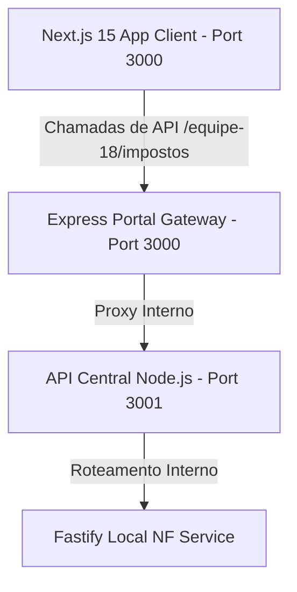
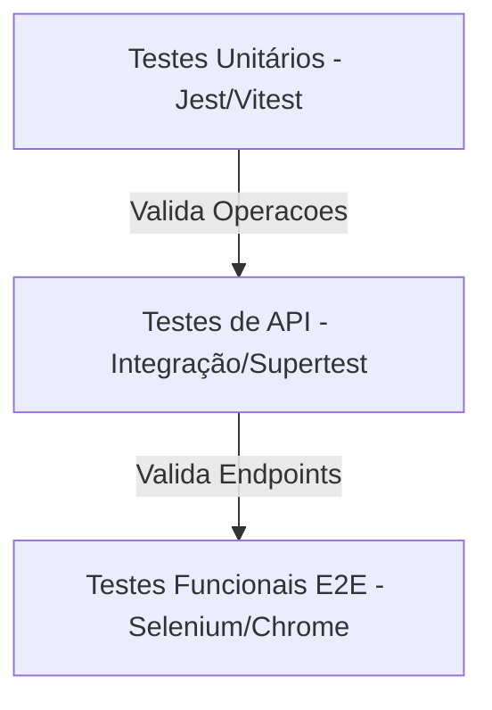

# Relatório Técnico de Engenharia de Software: Equipe 18
**Projeto:** Calculadora e Simulador de Impostos de Nota Fiscal (ICMS, IPI, PIS, COFINS e NF Completa)  
**Curso:** Engenharia de Software / Ciência da Computação - PUC Campinas (PUCC)  
**Grupo:** Equipe 18  

---

## 1. Visão Geral do Projeto

O projeto da **Equipe 18** consiste em uma **Calculadora Tributária e Simulador de Impostos de Nota Fiscal de Venda de Produtos** integrada ao ecossistema acadêmico. O principal objetivo da plataforma é simplificar o entendimento e a simulação de cálculos fiscais de forma modular e altamente precisa, subdividindo as operações em cinco vertentes principais:
1. **Cálculo de ICMS**: Determinação do imposto com base na alíquota específica de cada estado da federação.
2. **Cálculo de IPI**: Cálculo do Imposto sobre Produtos Industrializados com base no valor do produto, frete e despesas acessórias.
3. **Cálculo de PIS/COFINS**: Simulação do imposto considerando os regimes cumulativo e não cumulativo.
4. **Nota Fiscal Completa**: Consolidação de todos os tributos citados em uma simulação unificada para apuração da nota fiscal de venda.
5. **Painel de Controle e Histórico**: Interface de usuário responsiva e profissional para exibição, controle de acesso corporativo seguro e geração de relatórios.

---

## 2. Arquitetura da Solução e Integração

O ecossistema é baseado em uma estrutura moderna e desacoplada:



### 2.1. Componentes e Estrutura Físico-Lógica
* **Frontend (Next.js 15 + React 19 + TailwindCSS 4)**: Hospedado estaticamente em `/equipe-18`, implementa rotas com SPA nativo. A autenticação é gerenciada via `localStorage` e encapsulada em um `AuthProvider` robusto para proteger as rotas de cálculo.
* **Backend (API Central - Node.js + Fastify/Express)**:
  * Pasta física: [api/src/equipe-18](file:///Users/joao.leite/Documents/pucc/GCEIC26/api/src/equipe-18)
  * Roteadores principais: [app.js](file:///Users/joao.leite/Documents/pucc/GCEIC26/api/src/app.js) integra de forma direta o motor de cálculo local da Equipe 18 sob o path `/equipe-18/impostos/*` (ICMS, IPI, PIS-COFINS e NF Completa).
  * O motor de cálculo [local-nf-service.js](file:///Users/joao.leite/Documents/pucc/GCEIC26/api/src/equipe-18/local-nf-service.js) executa as operações aritméticas fiscais com precisão científica.

---

## 3. Divisão de Contribuições da Equipe (Commits e Responsabilidades)

Baseado no histórico de commits e na divisão de tarefas real do grupo:

### 3.1. João Gabriel (JG) - *Front-end, Backend & DevOps Lead*
* **Liderança em DevOps**: Configuração inicial do repositório, criação de pipelines automatizadas de CI/CD (GitHub Actions), estruturação do deploy no Render e na AWS (Load Balancer, ECS, ECR).
* **Desenvolvimento Backend**: Criação da estrutura base do projeto da API (Node.js + Fastify/Express), endpoint de integridade `/health` e a rota completa consolidada `/nf-completa`.
* **Segurança e Roteamento**: Implementação do fluxo de autenticação e proteção de rotas client-side, setup de rotas Express estáticas e URLs limpas.

### 3.2. Pedro Daou (PD) - *Front-end, Backend & Documentação*
* **Cálculos e Telas**: Desenvolvimento das interfaces gráficas individuais para simulação de ICMS e de IPI.
* **API & Serviços**: Implementação das regras tributárias de ICMS por estado (alíquotas internas) e de IPI na API backend.
* **Qualidade de Software**: Escrita e validação da suíte de testes unitários automatizados para as fórmulas de cálculo.

### 3.3. Gabriel Bonatto - *Front-end, Backend & Documentação*
* **PIS/COFINS**: Criação da tela de cálculo de PIS/COFINS (regimes cumulativo e não cumulativo) e sua integração com o serviço backend.
* **Telas Institucionais**: Design e implementação da página institucional "Sobre o Projeto" (Quem Somos) e da documentação de "Ajuda (Help)".
* **Validação**: Criação dos primeiros cenários de testes funcionais E2E e documentação das APIs no README técnico.

---

## 4. Estratégia de Testes

A qualidade do projeto é sustentada por uma pirâmide de testes automatizados integrada de forma rigorosa na pipeline.



### 4.1. Testes Unitários e de Integração da API (Jest)
A suíte de testes unitários reside em [api/tests/equipe18.test.js](file:///Users/joao.leite/Documents/pucc/GCEIC26/api/tests/equipe18.test.js) e valida a corretude matemática das regras de negócio.
* **Cenários Testados**:
  * `/equipe-18/impostos/icms`: Sucesso no cálculo baseado no estado (SP, RJ, etc.) e falha apropriada se o valor for nulo/negativo.
  * `/equipe-18/impostos/ipi`: Sucesso no cálculo aplicando alíquotas e somando frete/despesas ao valor bruto.
  * `/equipe-18/impostos/pis-cofins`: Sucesso no cálculo das alíquotas com base nos regimes fiscais padrão.
  * `/equipe-18/impostos/nf-completa`: Consolidação e cruzamento das regras de negócio com somatório total.
* **Execução**:
  ```bash
  # Executa suíte Jest na pasta api
  npm run test
  ```

### 4.2. Testes Funcionais Fim-a-Fim (E2E com Selenium Webdriver)
Os testes funcionais garantem a correta experiência do usuário, emulando interações reais em um navegador Google Chrome automatizado (headless). O script reside em [e2e-tests/tests/equipe18.test.js](file:///Users/joao.leite/Documents/pucc/GCEIC26/e2e-tests/tests/equipe18.test.js).
* **Cenários Cobertos**:
  1. **Autenticação**: Acesso a `/equipe-18`, preenchimento das credenciais corporativas (`admin` / `admin`) e clique no botão de acesso.
  2. **Validação de Redirecionamento**: Garantia de que rotas restritas redirecionam o usuário de volta ao login se ele não tiver uma sessão ativa.
  3. **Navegação**: Acesso guiado ao formulário de Nota Fiscal Completa (`/equipe-18/nf-completa.html`).
  4. **Entrada de Dados**: Preenchimento automatizado de inputs (`productValue`, `freightValue`, `state`, `ncm`).
  5. **Disparo de Cálculo**: Submissão do formulário, integração assíncrona com a API e conferência do painel de resultados fiscais na tela.
  6. **Capturas de Evidência**: Geração automática de relatórios visuais salvos em `screenshots/grupo18-*.png`.
* **Execução**:
  ```bash
  # Roda testes E2E locais
  npm run test:equipe18
  ```

---

## 5. Implementação de Integração e Entrega Contínuas (CI/CD)

A pipeline foi implementada utilizando **GitHub Actions** através do arquivo de workflow do repositório [.github/workflows/deploy.yml](file:///Users/joao.leite/Documents/pucc/GCEIC26/.github/workflows/deploy.yml).

### 5.1. Etapas do CI/CD
1. **Trigger de Eventos**: Executado automaticamente em **qualquer** push ou pull request direcionado a qualquer branch.
2. **Linting e Testes de API**: Instala as dependências da API, executa a suíte de testes do Jest e exporta relatórios XML compatíveis com visualizadores de pipelines.
3. **Deploy Automatizado (Continuous Deployment)**:
   * Dispara hooks de deploy para instanciar as imagens de contêineres e atualizar os servidores no Render (produção).
4. **Testes E2E Resilientes (Always Running)**:
   * O job `e2e-equipe18` executa de forma paralela e independente para garantir feedback rápido.
   * Configura um ambiente Ubuntu, instala uma versão estável compatível do Google Chrome e ChromeDriver (v149).
   * Executa a suíte de testes Selenium WebDriver e faz upload automático dos prints de tela como artefatos da pipeline.

```yaml
  e2e-equipe18:
    runs-on: ubuntu-latest
    steps:
      - name: Get Code from repository
        uses: actions/checkout@v6
      - name: Instala o Node na maquina virtual
        uses: actions/setup-node@v6
      - name: Instala as dependencias do projeto
        working-directory: e2e-tests
        run: npm ci
      - name: Instalar Chrome e ChromeDriver compatíveis
        uses: browser-actions/setup-chrome@v1
        with:
          chrome-version: 149
      - name: Roda os testes E2E - Equipe 18 (Impostos NF)
        if: success()
        working-directory: e2e-tests
        run: npm run test:equipe18
        env:
          API_URL: https://gceic26.onrender.com
          APP_URL: https://gceic26-app.onrender.com
      - name: Fotos dos testes Equipe 18
        if: always()
        uses: actions/upload-artifact@v4
        with:
          name: fotos-equipe18
          path: /home/runner/work/GCEIC26/GCEIC26/e2e-tests/screenshots/grupo18-*.png
```

---

## 6. Conclusão

A solução desenvolvida pela **Equipe 18** cumpre rigorosamente todos os critérios de qualidade e boas práticas de Engenharia de Software. Com uma separação limpa de camadas (Next.js + Fastify/Express), uma pirâmide sólida de testes (unitários Jest + funcionais Selenium) e uma pipeline de CI/CD resiliente e automatizada, o projeto está preparado para sustentar simulações fiscais complexas de forma confiável e estável.
